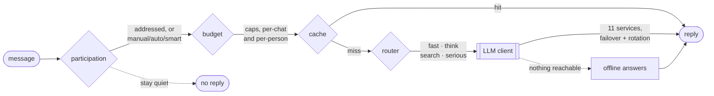

<div align="center">

# Astolfo

**A Telegram bot that behaves like a member of your group chat — not an assistant.**

[](https://github.com/hami9/Astolfo/actions/workflows/ci.yml)
[](https://github.com/hami9/Astolfo/actions/workflows/codeql.yml)
[](https://github.com/hami9/Astolfo/actions/workflows/audit.yml)
[](pyproject.toml)
[](LICENSE)

[Quick start](#quick-start) · [How it works](#how-it-works) · [Owner's panel](#the-owners-panel) · [Providers](#providers) · [Docs](#documentation)

</div>

---

It decides for itself whether a message deserves an instant reply, real reasoning, or a
web search. It reads photos, stickers, GIFs, videos and voice messages. It stacks eleven
API providers behind one client and fails over between them without the chat noticing.
And when every last one of them is out of allowance, it still answers the things that
need no model at all — honestly, rather than by guessing.

Text in, text out. The bot never generates images or audio.



## Features

| | |
|---|---|
| 🎭 **Layered persona** | The system prompt is built from ordered layers — narrative identity, voice markers, canon anchors, group behaviour, language mirroring, banned assistant-isms, an in-character answer to "are you a bot?", and a highest-priority truthfulness layer. Traits are written as identity rather than commands, with few-shot examples in four moods and a slim reminder re-injected periodically so the voice does not flatten in long chats. |
| 🧭 **Adaptive routing** | Regex heuristics classify most messages for free — small talk goes to `fast`, technical questions to `think`, time-sensitive facts to `search`, distress to `serious`. Only ambiguous messages reach a small LLM dispatcher, and its verdicts are cached. The mode drives the model, temperature, token ceiling, reasoning budget and whether web search runs. |
| 🔎 **Grounded answers** | Search-mode replies run at low temperature over live web results and cite their sources. Canon anchors keep the persona from inventing its own lore, and the truthfulness layer makes "I don't know" the in-character answer rather than a failure. |
| 🖼 **Multimodal input** | Photos and stickers are downscaled and encoded, GIFs, videos and video notes are sampled into frames with ffmpeg (falling back to Telegram thumbnails), and voice messages are transcoded to mono mp3. |
| 🔌 **Eleven providers, one client** | Services are tried in order and fail over on refusal, quota and rate limits. Each holds several keys; a refused key rests and the next takes over mid-conversation. Health survives a restart, so a quota that runs until tomorrow is still known tomorrow. |
| 💸 **Credit controls** | Per-call cost is recorded and persisted. As spend approaches the daily cap the bot degrades instead of dying: cheap model only, then replies only when addressed, then a polite stop. Per-chat and per-person daily call limits sit on top. |
| 🧠 **Offline answers** | With every service resting, greetings, thanks, "who are you", the time, the date and plain arithmetic are still answered in character. Anything needing actual knowledge gets an honest "my brain is offline" — never a guess. |
| 🎛 **Run it from Telegram** | A private-chat control panel for the owner: services and keys, every setting, groups, people, limits, server health, update and restart. Changes take effect immediately — no editing `.env`, no restart. |
| 🔐 **Built to be exposed** | Keys are encrypted at rest and only ever shown masked. Message text is never stored — a test checks the database file and its write-ahead log. The bot runs unprivileged and can ask a root helper for exactly two things. |

## Quick start

```bash
git clone https://github.com/hami9/Astolfo && cd Astolfo
python3 -m venv .venv && source .venv/bin/activate
pip install -r requirements.txt
cp .env.example .env      # add your bot token and one API key
python main.py
```

Two values are required: `TELEGRAM_BOT_TOKEN` from [@BotFather](https://t.me/BotFather),
and one API key from any provider in the table below. Everything else has a default.

Install `ffmpeg` for voice and video analysis (`apt install ffmpeg` / `brew install ffmpeg`).

> [!IMPORTANT]
> **Turn off Group Privacy** in BotFather so the bot can see normal group messages:
> `/mybots` → your bot → *Bot Settings* → *Group Privacy* → **Turn off**, then remove and
> re-add the bot to the group.

Deployment on a VPS, Docker or Replit is covered in
[docs/DEPLOYMENT.md](docs/DEPLOYMENT.md); running the bot from Telegram afterwards in
[docs/ADMIN.md](docs/ADMIN.md).

## How it works

Every message walks the same path, and most of it costs nothing:

1. **Participation** — a reply, a mention or the bot's name always gets an answer.
   Otherwise the chat's mode decides: `manual` stays quiet, `auto` joins at the chance you
   set, `smart` does both depending on how busy the chat is, how much budget is left, and
   whether any service is actually reachable.
2. **Budget** — the daily cap and the per-chat and per-person call limits return an
   allowance that can strip capabilities from the turn or block it outright.
3. **Cache** — an identical recent message in the same chat is answered with no model call.
4. **Routing** — heuristics decide the mode for free; the LLM dispatcher is consulted only
   when they are unsure.
5. **Model** — the first working service and key answer; refusals, quotas and rate limits
   move to the next one without the chat noticing.
6. **Polish** — markdown, name prefixes and assistant-isms are stripped, sources appended,
   long replies split to Telegram's limit.

Full detail in [docs/ARCHITECTURE.md](docs/ARCHITECTURE.md).

## Commands

| Command | Description |
| --- | --- |
| `/start`, `/help` | introduction and usage |
| `/about` | channel, creator and what the bot is |
| `/chance 0-100` | how often the bot joins conversations unprompted (admin) |
| `/mode auto\|fast\|think\|search` | pin a response mode (admin) |
| `/usage` | today's cost, tokens, cache hits and budget state |
| `/status` | current settings and capabilities |
| `/reset` | clear this chat's history and notes (admin) |
| `/mute`, `/unmute` | silence the bot or bring it back (admin) |
| `/donate` | send Telegram Stars towards the API bill |
| `/panel` | the owner's control panel, private chat only |

## The owner's panel

`/panel`, in a private chat with the bot, from the account named by `MASTER_ID`:

| Screen | What it is for |
|---|---|
| **services** | Every service: keys, health, today's calls, order, on/off, and adding your own |
| **settings** | Any setting by name, plus switches for the common ones |
| **groups** | Every group: activity, mute, leave, how talkative it is, daily limit |
| **people** | Who has spoken to it, where, blocking, and per-person limits |
| **server** | Health, log, update, restart |
| **data** | Row counts, the audit trail, a backup of the database |

Keys are added by message and the message is deleted straight away; they are stored
encrypted and only ever shown masked. Destructive actions take a second press. Nothing
here needs a restart. See [docs/ADMIN.md](docs/ADMIN.md).

## Providers

Any OpenAI-compatible endpoint works. Eleven are known out of the box, and more can be
added from the panel — name, URL, models — with no code change.

| Service | Endpoint | Notes |
|---|---|---|
| `openrouter` | `openrouter.ai/api/v1` | discovers zero-cost models, web search plugin, usage accounting |
| `google` | `generativelanguage.googleapis.com` | Gemini, free tier |
| `groq` | `api.groq.com/openai/v1` | fast Llama inference, free tier |
| `github` | `models.github.ai/inference` | GitHub Models |
| `cerebras` | `api.cerebras.ai/v1` | free tier |
| `mistral` | `api.mistral.ai/v1` | free tier, Pixtral for vision |
| `cohere` | `api.cohere.ai/compatibility/v1` | trial keys are free and rate limited |
| `huggingface` | `router.huggingface.co/v1` | monthly credit, then paid |
| `sambanova` | `api.sambanova.ai/v1` | free tier |
| `deepinfra` | `api.deepinfra.com/v1/openai` | pay as you go after the signup credit |
| `aimlapi` | `api.aimlapi.com/v1` | small free allowance, then paid |

> [!NOTE]
> Several keys per service is for keys you already hold — rotating one without downtime,
> or a work key beside a personal one. It is not a way to hold several accounts at one
> provider to get past its free quota: that breaks every provider's terms and ends with
> all of them closed.

## Configuration

Every setting is an environment variable, and every one of them can be overridden from
the panel at runtime. See [.env.example](.env.example) for the full list with defaults.
The ones worth knowing:

| Variable | Default | Purpose |
| --- | --- | --- |
| `TELEGRAM_BOT_TOKEN` | — | required |
| `MASTER_ID` | — | the numeric Telegram id that owns the panel |
| `MODEL_FAST` | `google/gemini-2.5-flash` | everyday chatter |
| `MODEL_THINK` | `google/gemini-2.5-pro` | reasoning-heavy turns |
| `MODEL_ROUTER` | `google/gemini-2.5-flash-lite` | the dispatcher |
| `REPLY_MODE` | `smart` | `manual`, `auto` or `smart` participation |
| `GROUP_REPLY_CHANCE` | `0.30` | unprompted participation |
| `DAILY_BUDGET_USD` | `0` (off) | spend cap with graceful degradation |
| `CHAT_DAILY_CALL_LIMIT` | `0` (off) | model calls per chat per day |
| `USER_DAILY_CALL_LIMIT` | `0` (off) | model calls per person per day |
| `FREE_MODE` | `0` | zero-cost models only |
| `RESPONSE_CACHE` | `1` | reuse answers to identical recent messages |
| `WEB_SEARCH` | `1` | ground factual answers in live results |
| `BOT_LANG` | `en` | language of command replies (`en` or `fa`) |

Unknown model ids are detected at startup and replaced from `FALLBACK_MODELS`.

## Documentation

| Document | What is in it |
|---|---|
| [docs/ARCHITECTURE.md](docs/ARCHITECTURE.md) | request lifecycle, prompt structure, memory, failure behaviour |
| [docs/ADMIN.md](docs/ADMIN.md) | the owner's panel, services, modes, limits, updating the server |
| [docs/DEPLOYMENT.md](docs/DEPLOYMENT.md) | VPS with systemd, Docker, Replit |
| [docs/COST.md](docs/COST.md) | what each turn costs and every lever that lowers it |
| [SECURITY.md](SECURITY.md) | what this protects, what it does not, and how to report a problem |
| [CONTRIBUTING.md](CONTRIBUTING.md) | how to set up, what the tests expect, house style |
| [CHANGELOG.md](CHANGELOG.md) | what changed and when |

## Development

```bash
pip install -r requirements-dev.txt
pytest -q          # 374 tests, fully offline
ruff check .
```

Tests use a mocked HTTP transport, so the exact request body sent to each provider is
asserted without any network access or credentials. CI runs the suite on Python 3.10,
3.12 and 3.13, with CodeQL and a dependency audit alongside it.

## Layout

```
main.py                    entry point
astolfo/config.py          environment-driven settings
astolfo/persona.py         layered prompt, few-shot examples, locale detection
astolfo/routing.py         fast / think / search / serious dispatcher
astolfo/providers.py       the known services and their keys
astolfo/llm.py             the client: failover, key rotation, retries
astolfo/services.py        stored services, keys and their health
astolfo/participation.py   manual, auto and smart: how talkative the bot is
astolfo/offline.py         the answers that need no model at all
astolfo/budget.py          cost accounting and the degradation ladder
astolfo/cache.py           TTL + LRU caches
astolfo/media.py           images, stickers, GIFs, video, audio
astolfo/memory.py          history, long-term notes, persistence
astolfo/text.py            addressing, polishing and splitting a reply
astolfo/db.py              SQLite: chats, people, settings, keys, audit
astolfo/settings_store.py  settings and keys that change without a restart
astolfo/crypto.py          encryption for the stored keys
astolfo/master.py          who owns the bot
astolfo/membership.py      joining and leaving groups
astolfo/admin/             the owner's panel
astolfo/server_ops.py      machine health, and asking the root helper for a job
astolfo/branding.py        the project's own links and identity
astolfo/donate.py          Telegram Stars
astolfo/strings.py         every user-facing string, in English and Persian
astolfo/runtime.py         the shared services, assembled once
astolfo/chat.py            the message pipeline
astolfo/commands.py        command handlers
astolfo/app.py             wiring, lifecycle, keepalive server
deploy/                    VPS installer and the privileged helper
docs/                      architecture, deployment, cost control, admin
tests/                     the offline suite
```

## Contributing

Issues and pull requests are welcome — see [CONTRIBUTING.md](CONTRIBUTING.md) for the
setup, what CI will check, and the house style. Everyone taking part is expected to
follow the [Code of Conduct](CODE_OF_CONDUCT.md).

## Notes

Astolfo and the Fate series belong to TYPE-MOON. This is a non-commercial fan persona,
and it is worth saying so in the bot's Telegram bio.

Keep your keys in a git-ignored `.env` or the panel's encrypted store, never in the
repository.

## License

[MIT](LICENSE).
