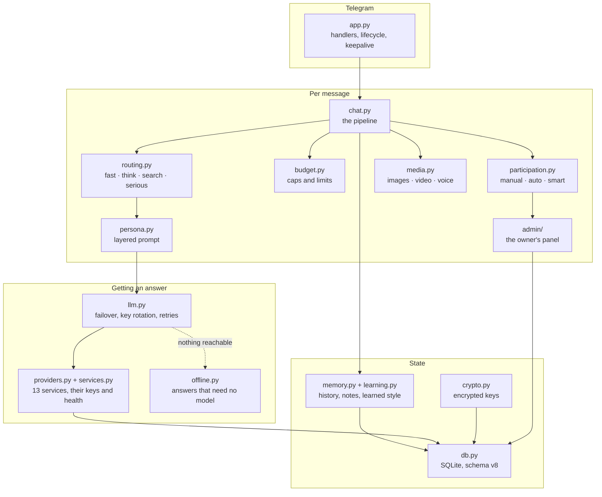
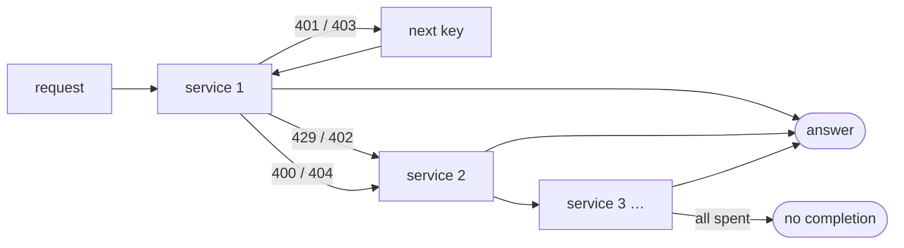

# Architecture

The bot is a long-polling Telegram application with four concerns kept apart: deciding
whether to speak, deciding how expensively, getting an answer out of whichever provider
is alive, and sounding like the same character while doing it.



## Request lifecycle

`chat.handle_message` is the whole pipeline, in this order:

1. **Filter** — other bots, blocked people and muted chats are dropped before anything
   else. An empty message with no attachment is not a message.
2. **Normalise** (`text.normalize_input`) — Persian arrives in several spellings of the
   same word, so Arabic letter forms, Arabic-Indic digits, diacritics, kashida, stretched
   words and invisible marks are folded once, on the way in. Everything downstream — the
   prompt, the history, the response-cache key — then sees one spelling. Nothing is
   normalised on the way out: the chat sees what the person typed.
3. **Remember** — every message enters the chat history exactly once, whether or not the
   bot answers, so it hears the conversation it is sitting in. A message that replies to
   another is stored as `Sara → Reza: ...`, which is what keeps two conversations in one
   group from reaching the model as one. Media is stored as a short placeholder, never as
   base64. A counting row is written for the chat and the sender.
4. **Address check** (`text.is_addressed`) — replies to the bot, `@mentions`, text mentions
   and the name "astolfo" all count. Private chats always count.
5. **Budget and limits** (`budget.BudgetTracker.check`) — the monthly cap, the per-chat and
   per-person daily call limits, then the daily spend ladder. Returns an `Allowance` that
   can block the turn or strip capabilities from it. A limit set on one group or one person
   beats the global one.
6. **Participation** — when not addressed, `participation.should_join` applies the chat's
   mode and the cooldown, then scores the message with `interest.rate`: an open question,
   media, something it has opinions about or a running joke in the notes raise it; a reply
   between two other people, a sign-off, or having just spoken lower it. The reply chance
   moves the bar rather than being the whole decision. `attention` scales that chance down
   while another chat holds its attention, so one bot does not hold four unprompted
   conversations at once.
7. **The offline shortcut** — if the bot is addressed with plain text and no service is
   usable, the turn is answered from `offline.py` and ends here rather than spending a
   round-trip to learn what it already knows.
8. **Response cache** — an identical recent message in the same chat is answered from cache
   with no model call.
9. **Media collection** (`media.collect`) — downloads and converts attachments. A bundle
   the current model cannot read is dropped with an instruction to say so honestly.
10. **Routing** (`routing.Router.decide`) — heuristics first, the LLM dispatcher only when
   they are unsure and the budget allows. With `HEAVY_LIFTING` off, homework and heavy
   maths are settled as `fast`: the persona declines them, so paying a think model to
   produce the refusal is waste.
11. **Prompt assembly** (`chat.build_messages`) — static persona, dynamic context, trimmed
    history, optional persona reminder, current turn.
11b. **Length** (`tuning.reply_ceiling`) — the token ceiling comes down when the day's
    budget is running out, and when this chat has shown it answers short replies and
    scrolls past long ones. Counters only; no model call and no message text.
12. **Model call** (`llm.LLMClient.chat`) — service failover, key rotation, model fallbacks,
    retries, optional web search.
13. **Quality guard** (free mode only) — a reply that leaks the prompt, echoes the question
    or repeats the last one is not sent; the model is retired and one other is asked.
14. **Fallback** — with no completion at all, `offline.py` is tried before an apology, so a
    greeting is still answered when every model is gone.
15. **Post-processing** (`text.polish`) — strip markdown, name prefixes and assistant-isms,
    split to Telegram's length limit, append sources for search answers.
16. **Background** — fold old turns into long-term notes, and into the learned style, in
    the same call.

Steps 8 to 14 run under a per-chat lock, so a busy chat never produces two overlapping
replies, and the lock is released before the reply is sent. Being spoken to during
someone else's turn waits for the lock, up to `memory.MAX_WAITING`; unprompted chatter
arriving mid-reply is dropped, because it is background rather than a question.

## Prompt structure

The prompt is deliberately split in two so that providers can cache the expensive half.

```
messages[0]  system   static persona   identity, voice, canon, group rules, language,
                                       banned behaviour, meta answers, truthfulness,
                                       few-shot examples, output rules   (~10 KB, stable)
messages[1]  system   dynamic context  response mode, media rules, learned style,
                                       notes, reply-arrow notation, who runs the
                                       group, whether it is distracted elsewhere
messages[2:] history  trimmed to what the chosen model can hold
messages[-1] user     current turn (text, or text + image/audio parts)
```

The current turn carries the thread. `Sara → Reza: yeah it works now` names who is being
answered, and a short quote of the message being replied to follows it in brackets — after
the message rather than before it, because the last thing a small model reads is the thing
it answers. Neither is sent when the message replies to nothing.

`messages[0]` is byte-identical for every turn of the same chat type and locale, which is
what makes provider-side prefix caching effective. For Anthropic models an explicit
`cache_control` breakpoint is attached; Gemini and OpenAI cache stable prefixes on their
own. A test asserts the static block does not change between turns.

Free mode swaps in a compact persona under a quarter of the size: a 9-to-30B model drowns
in the full one and starts quoting the scaffolding back. It gets the short media rules for
the same reason.

Only the lines that apply to this turn are sent. The learned style contributes the chat's
own line plus one line each for the sender and whoever they are answering, never the whole
book; the list of people recently talking is dropped once there is a transcript, because
every line of it already starts with a name.

## Response modes

| Mode | Trigger | Model | Temperature | Reasoning | Web |
| --- | --- | --- | --- | --- | --- |
| `fast` | small talk, reactions, short messages | `MODEL_FAST` | 0.95 | disabled | no |
| `think` | code, math, comparisons, explanations | `MODEL_THINK` | 0.55 | `THINK_EFFORT` | no |
| `search` | prices, news, versions, dated facts | `MODEL_SEARCH` | 0.25 | off | yes |
| `serious` | distress signals | `MODEL_THINK` | 0.60 | low | no |

Attachments override the model with `MODEL_MEDIA` unless the turn is already `think` or
`serious`. `/mode` pins a mode for a chat, and the budget can force `fast` from above.

## The provider stack

`providers.py` holds the presets, `services.py` holds what the owner has saved, and
`llm.py` is the client that uses both. `discover()` merges three sources in increasing
priority: the presets in code, the environment, and the database.



- **Keys live on the request, not the client.** The `Authorization` header is built per
  call, which is what makes several keys per one service possible at all.
- **A refused key rests, the service does not.** 401 or 403 rests that key for a day,
  records what it was told, and the next key takes over inside the same turn.
- **A spent service rests.** 429 or 402 rests the whole service for as long as the response
  asks, and the turn continues on the next one.
- **A rejected request moves on.** A 400 or a 404 is the service's opinion of the request,
  not of the bot, so the next service is offered it. A 404 first walks the rest of that
  service's model list, because a renamed model id is the common cause. Every 4xx body is
  logged.
- **Health survives a restart.** Rests are stored as wall-clock time, so a quota that runs
  until tomorrow is still known tomorrow. Nothing probes to recover; ordinary traffic
  retries a service once its rest is over.
- **Only OpenRouter gets OpenRouter's fields.** The fallback model list, the search plugin,
  the provider-sort hint and usage accounting are gated behind `openrouter_extensions`,
  because a plain OpenAI-compatible endpoint answers an unknown field with a 400.
- **Every service is asked what it offers at startup.** All of them, not just the one that
  advertises a free catalog, and the answers merge into one catalog keyed by service and
  id. Configured ids a service no longer offers are dropped; a service that has renamed
  its whole line-up adopts its own instead of being left with a list that 404s. What is
  *called* stays capped at `ADOPT_AT_MOST`, because that list is walked on failover.
- **A listing that says almost nothing is still read.** `catalog.py` infers the window
  from `context_length`, `top_provider.context_length`, `context_window`, `max_model_len`
  or a table of model families, and vision from the id when no modalities are declared.
  An inferred window is marked with a `~` so a guess is never shown as fact. Silence
  about price is read against the service: free where its offer is a standing free tier,
  paid otherwise.

`PINNED_SERVICE`, or **📌 use only this** in the panel, stops the chain on one service.

## Participation

Three modes, global or per group, resolved on every unaddressed message:

| Mode | Behaviour |
|---|---|
| `manual` | answers only when replied to, mentioned, or called by name |
| `auto` | also joins conversations on its own, at `GROUP_REPLY_CHANCE` |
| `smart` | auto while that makes sense, manual when it does not |

Smart drops to manual when every service is resting, when 70% of the daily budget is gone,
or when the chat is moving faster than twelve messages a minute — measured from a bounded
deque of arrival times, not a counter that has to be reset. Being spoken to always gets an
answer in every mode; silence is what `/mute` is for.

## Memory

- **Short term** — a bounded deque per chat, trimmed when building a prompt to what the
  chosen model can actually hold: the catalog reports each model's context window and the
  budget is measured against the real size of the prompt being built, so moving a job to a
  small model shortens its memory instead of overflowing it. A single turn is clipped to
  `MAX_TURN_CHARS` in the prompt — one pasted wall of text used to fill the budget on its
  own and push every other turn out, which reads exactly like the bot losing the thread.
  Consecutive turns from the same role are merged, so a run of group messages reads as
  overheard conversation rather than a queue of questions.
- **Long term** — every twelve turns, the oldest unfolded ones become notes (regulars,
  running jokes, ongoing situations) via a cheap model in the background.
- **Learned style** (`learning.py`) — the same background call also reports how this chat
  likes to be talked to: one line for the chat, one for each of a dozen people at most,
  about manner rather than facts. It rides in the chat's row as JSON and only the lines
  about whoever is in the current turn are ever sent, so a group of twenty pays for two.
  **panel → groups → a group** shows it and can forget it.
- **Reception** (`tuning.Reception`) — six counters per chat: how many short, medium and
  long replies were sent, and how many of each somebody answered. It costs nothing to
  collect, and it is what shortens replies in a group that ignores long ones. The reply
  waiting on an answer carries a `tuning.Credit` — service, model, prompt shape and mode —
  because whether anybody replied is only known on the following turn, and in free mode
  the model has moved on by then.
- **Outcomes** (`db.outcomes`) — the same evidence, per model rather than per chat. Every
  turn already produced it: whether `_shape` had to strip a speaker label or cut a
  fabricated turn, whether `looks_broken` fired, tokens, cost, how long the call took, and
  whether a human answered. All of it went to a log line and nowhere else. It is now
  counted per day, service, model, prompt shape and mode, bounded at `MAX_OUTCOME_ROWS` a
  day, and pruned with everything else.
- **Eviction** — chats idle beyond `CHAT_TTL` are dropped, and an LRU bound caps memory at
  `MAX_CHATS`; a chat that is mid-reply is never evicted.

## Persistence

`data/` holds everything stateful, and the directory itself is created 700:

| Path | What is in it |
|---|---|
| `astolfo.db` | chats, people, settings, services, keys, audit — SQLite in WAL mode, mode 600 |
| `secret.key` | the Fernet key that decrypts the stored API keys, mode 600 |
| `usage.json` | daily cost buckets, kept 35 days |
| `control/` | the spool the root helper watches, when it is installed |

The schema is versioned with `PRAGMA user_version` (currently **7**) and migrated
additively — a column is added only if it is not already there, so re-running a migration
is harmless. A file written by a newer version is left alone with a warning rather than
migrated backwards.

| Table | Rows |
|---|---|
| `chats` | one per chat: title, kind, activity counts, mute, mode, daily limit |
| `users` | one per person seen: name, first and last seen, blocked |
| `members` | who is in which chat, and how active |
| `settings` | any setting overridden from the panel; beats the environment |
| `secrets` | the legacy single-key store, emptied by the v2 migration |
| `services` | a preset override, or a service the code has never heard of |
| `credentials` | keys: encrypted value, label, order, health, what it last said |
| `service_usage` | requests, failures, tokens and cost per service per day |
| `outcomes` | per day, service, model, prompt shape and mode: calls, answered, repaired, broken, tokens, cost, latency |
| `seen_models` | every model id any service has listed, and when it first appeared |
| `model_health` | how many unusable replies each model has produced, so a restart does not forget |
| `audit` | who pressed what in the panel |

**Message text is never written to disk.** History lives in memory; the database keeps
counts. `tests/test_security.py` opens the database file and its write-ahead log and greps
them for the text of a message it just sent.

## Answering with no model

`offline.py` handles what needs no knowledge: greetings, goodbyes, thanks, "how are you",
"who are you", the time, the date, `ping`, and plain arithmetic — parsed with `ast` and
evaluated over four operators, never `eval`. Everything else returns `None`, and the
caller says "my brain is offline" rather than guessing. Nothing in the module invents a
fact; a rule that is not sure declines.

It is used twice: as a shortcut before the model call when no service is usable, and as a
last resort after one that produced nothing.

## Concurrency and lifecycle

- `concurrent_updates(True)` with `AIORateLimiter`, so slow turns do not block the queue
  while Telegram's own rate limits are respected.
- One `asyncio.Lock` per chat guards the reply-composing section.
- An autosave task flushes dirty state every 120 seconds, plus once on shutdown; a Stars
  payment is written immediately rather than waiting for it.
- The keepalive HTTP server answers `GET /` with 200 while the process is alive, for
  platforms that need a URL to ping.
- Settings changed from the panel are adopted in place: a new client is built, the old one
  is closed, and the chat store is deliberately kept so no group forgets mid-reply.

## Failure behaviour

| Failure | Behaviour |
| --- | --- |
| Unknown model id | detected at startup, replaced from `FALLBACK_MODELS` |
| Service returns 404 | walk the rest of its model list, then move to the next service |
| Service returns another 4xx | log the body, offer the request to the next service |
| Key refused (401 / 403) | rest that key for a day, rotate to the next one, same turn |
| Quota or rate limit (429 / 402) | rest the whole service for as long as it asks |
| 5xx | exponential backoff with jitter, honouring `Retry-After` |
| Provider rejects `reasoning` or the web plugin | parameter dropped, request retried |
| Every service resting | offline answers, or one honest "my brain is offline" |
| No completion after retries | offline answer if there is one, else one in-character apology, only if addressed |
| Free model returns nothing or garbage | model retired, one other tried, then the turn ends quietly |
| ffmpeg missing | video falls back to thumbnails, voice is honestly declined |
| No vision model available | attachment dropped, the bot says so in one line |
| Dispatcher returns garbage | the heuristic decision is used |
| Budget exceeded | degrade, then stop with one notice per hour |
| Update fails to start | the server rolls back to the previous commit on its own |

## Testing

The suite is offline by construction. Provider calls go through `httpx.MockTransport`, so
the exact request body each service receives is asserted without a network or a key —
including which fields a non-OpenRouter service must *not* be sent. Fixtures in
`tests/conftest.py` build a `Runtime` against a temporary directory, so the database,
the encryption key and the panel are all exercised for real.
